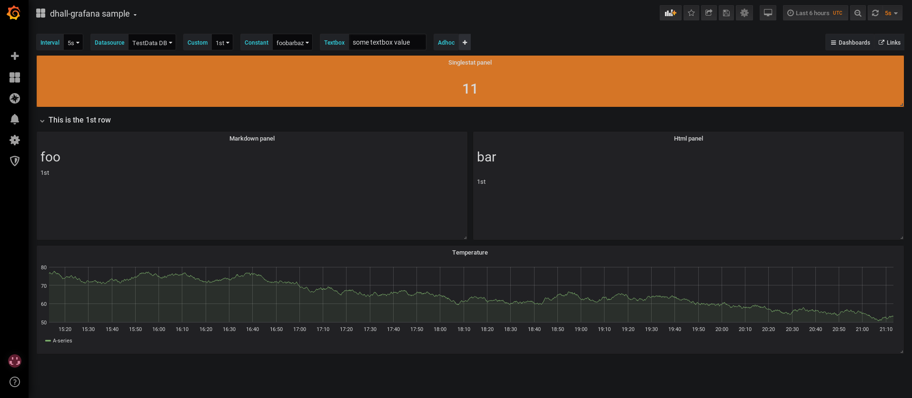

# dhall-grafana

Your [Grafana](http://www.grafana.org/) dashboards-as-code with [Dhall](https://dhall-lang.org/)!

# Usage

Install `dhall-to-json` by downloading it from [dhall-haskell/releases](https://github.com/dhall-lang/dhall-haskell/releases). When you have the binary in your `$PATH` it's as easy as running:

```
dhall-to-json --file all_dashboard.dhall
```

Import the output to Grafana and you're done!

Make sure you have a [TestData DB datasource](https://grafana.com/docs/features/datasources/testdata/) configured to see the [`all_dashboard.dhall`](./all_dashboard.dhall) graphs be populated.


