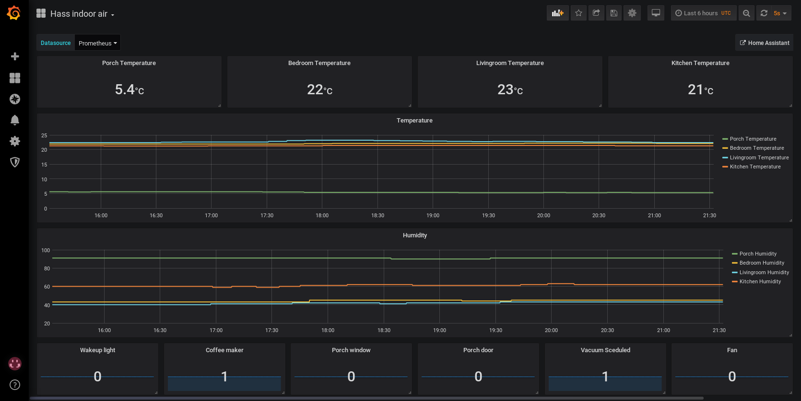

# Examples

Some examples you can use to start building your own dashboards and to learn Dhall!

If you want to test any of the dashboards out with mock data just set the `TEST_DASHBOARD`  environment variable like this:

```
$ export TEST_DASHBOARD="(./package.dhall).ScenarioId.random_walk"
$ dhall-to-json --file examples/hass_indoor.dhall
```

## [`hass_indoor.dhall`](./hass_indoor.dhall)


